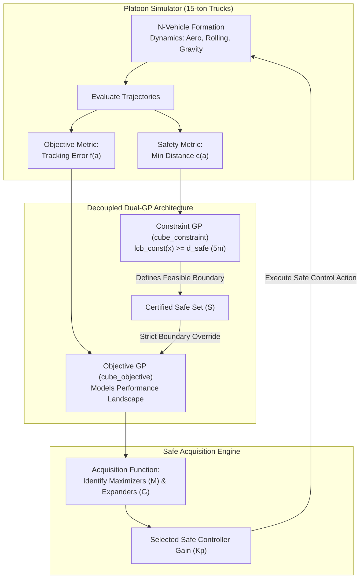

# Decoupled Safe Bayesian Optimization in Distributed Multi-Agent Systems

[](https://www.python.org/downloads/)
[](https://pytorch.org/)
[](https://gpytorch.ai/)
[](https://opensource.org/licenses/MIT)

> **Course:** Multi-Agent Systems, Aalto University  
> **Authors:** Julia Szewczyk & Marina Tavernier (with contributions by T. Fu)  
> **Academic Report:** [`docs/Tavernier_Szewczyk_FinalReport.pdf`](docs/Tavernier_Szewczyk_FinalReport.pdf)

---

## 📌 Executive Summary

Tuning controller parameters (such as the proportional gain $K_p$) in safety-critical distributed Multi-Agent Systems (MAS) is a fundamental engineering challenge. In applications like **autonomous vehicle platooning (15-ton trucks)**, poor controller gains cause string instability—cascading velocity oscillations that amplify backwards through the platoon and cause catastrophic rear-end collisions.

Traditional distributed Safe Bayesian Optimization (Safe BO) relies on a **single Gaussian Process (GP)** that simultaneously models reward and enforces safety through sharp negative penalties. Such discontinuous "cliff-edge" rewards violate the smoothness assumptions of GP regression, degrading convergence and causing optimization failures.

This repository implements a **Decoupled Safe Bayesian Optimization (Decoupled Safe BO)** architecture:
1. **Objective GP ($\mathcal{GP}_{\text{obj}}$):** Models system performance (minimizing steady-state tracking error across the fleet) without safety-penalty cliff edges.
2. **Constraint GP ($\mathcal{GP}_{\text{const}}$):** Independently models physical safety boundaries (guaranteeing a strict minimum bumper-to-bumper distance clearance $c(a) \ge 5.0\text{ m}$).
3. **Safe Set Filtering:** The theoretical Safe Set $S$ is computed strictly from the Constraint GP and forcefully projected onto the Objective GP, restricting exploration candidates (Potential Maximizers $M$ and Expanders $G$) strictly within mathematically certified collision-free regions.



---

## 🔬 Theoretical & Algorithmic Background

### 1. Problem Formulation
Consider a platoon of $N$ autonomous heavy vehicles (trucks) following a lead vehicle moving at constant velocity $v_{\text{leader}} = 10\text{ m/s}$ with a target spacing $d_{\text{ref}} = 10\text{ m}$. Each vehicle $i \in \{1, \dots, N-1\}$ executes localized proportional control:
$$\tau_i(t) = K_p \cdot e_i(t)$$
where $e_i(t)$ is the distance error computed from bidirectional nearest-neighbor communications.

The constrained optimization problem is:
$$\max_{a \in \mathcal{A}^N} f(a) \quad \text{subject to} \quad c(a) \ge h_{\text{safe}}, \quad \forall t \ge 1$$
where:
- $f(a) = - \text{avg\_error} - T \cdot \text{collision\_penalty}$ represents tracking performance.
- $c(a) = \min_{t} d_{\text{bumper-to-bumper}}(t)$ is the physical safety distance.
- $h_{\text{safe}} = 5.0\text{ m}$ is the minimum allowed bumper clearance.

### 2. Time as a Latent Variable & Spatio-Temporal Kernel
In a decentralized topology with nearest-neighbor communication, each agent observes only a subset of the fleet. Unobserved actions of distant vehicles make the local reward appear non-stationary. To resolve this without centralized coordination:
- Time $t$ is treated as a **latent variable**.
- A separable **spatio-temporal kernel** $k(x, t, x', t') = k_S(x, x') \cdot k_T(t, t')$ is employed:
  - **Spatial Kernel ($k_S$):** Matérn 5/2 kernel modeling smooth spatial correlations over neighbor control gains.
  - **Temporal Kernel ($k_T$):** Non-stationary compound kernel combining an RBF kernel (capturing smooth convergence phases) and a Matérn 1/2 kernel (capturing abrupt parameter shifts during safe set expansion), smoothly blended via Brownian motion and reverse Brownian motion processes:
$$k_T(t, t') = k_{\text{RBF}}(t, t') + k_{\text{Mat12}}(t, t') \cdot k_{\text{BM}}(t, t') \cdot k_{\text{RBM}}(t, t')$$

### 3. Decoupled Safe Exploration
For each parameter candidate $x$ on discretized domain $\mathcal{X}$:
1. Compute lower confidence bound: $\text{lcb}_{\text{const}}(x) = \mu_{\text{const}}(x) - \beta_t \sigma_{\text{const}}(x)$.
2. Define the certified safe region:
$$S = \{ x \in \mathcal{X} \mid \text{lcb}_{\text{const}}(x) \ge h_{\text{safe}} \}$$
3. Overwrite the search space of the Objective GP with $S$.
4. Determine candidate actions:
   - **Potential Maximizers ($M$):** Points in $S$ with upper confidence bounds $\text{ucb}_{\text{obj}}(x) \ge \max_{x' \in S} \text{lcb}_{\text{obj}}(x')$.
   - **Potential Expanders ($G$):** Points in $S$ capable of expanding the safe set into currently unknown regions.
5. Select the action $x_{t+1} = \arg\max_{x \in M \cup G} \text{ucb}_{\text{obj}}(x)$ to evaluate in the next iteration.

---

## 📂 Repository Structure

The codebase is organized into modular source directories, documentation, and evaluation assets:

```
SafeOptProject/
├── .gitignore                   # Excludes Python bytecode, virtualenvs, checkpoints, temp files
├── README.md                    # Project documentation, architecture overview, and quickstart
├── requirements.txt             # Python dependencies (PyTorch, GPyTorch, NumPy, Matplotlib)
│
├── docs/                        # Academic reports and presentation assets
│   ├── Tavernier_Szewczyk_FinalReport.pdf   # Complete project report (May 2026)
│   └── Safe multiagent systems presentation.pptx # Course presentation slides
│
├── figures/                     # Experimental and scalability analysis plots
│   ├── estimate_sweep_full_comm.png  # Memory vs. agent count in full communication
│   └── runtime_sweep_full_comm.png   # Wall-clock runtime vs. agent count
│
└── src/                         # Source code
    ├── __init__.py              # Package marker
    ├── safeopt-MAS.py           # Main entry point: Decoupled Safe BO on platoon simulator
    ├── vehicle_class.py         # Longitudinal truck platoon simulator & P-controller
    ├── safebo_MAS_plot.py       # Visualization suite (2D mean, UCB, samples, reward curves)
    ├── scan_agent_breakpoint.py # Scalability & breakpoint analysis probe
    ├── truck.png                # Asset for platoon visual animation
    └── pacsbo/                  # Core SafeOpt / PACSBO algorithmic library
        ├── __init__.py          # PACSBO module exports
        ├── pacsbo_main.py       # ExactGP model, confidence bounds, M & G sets, SafeOpt loop
        └── custom_kernels.py    # Non-stationary Spatio-Temporal Brownian/RBF kernels
```

---

## ⚙️ Installation & Prerequisites

### Prerequisites
- Python 3.10+ (tested with Python 3.10 to 3.13)
- CUDA-enabled GPU (optional; CPU execution is fully supported)

### Setup Instructions

1. **Clone the repository:**
   ```bash
   git clone https://github.com/juliaszewczykk/SafeOptProject.git
   cd SafeOptProject
   ```

2. **Create and activate a virtual environment:**
   ```bash
   # Windows (PowerShell)
   python -m venv .venv
   .\.venv\Scripts\Activate.ps1

   # Linux / macOS
   python3 -m venv .venv
   source .venv/bin/activate
   ```

3. **Install dependencies:**
   ```bash
   pip install -r requirements.txt
   ```

---

## 🚀 Quickstart Guide

### 1. Run the Decoupled Multi-Agent Safe BO Optimization
Executes the full multi-agent controller tuning on an 8-vehicle platoon over 50 iterations:
```bash
python src/safeopt-MAS.py
```
**Expected Output:**
- Terminal progress bar via `tqdm`.
- Iteration-by-iteration exploration of $K_p$.
- Zero safety violations ($c(a) \ge 5.0\text{ m}$ maintained strictly at all iterations).
- Generates post-run summary figures (`mean_value_agent_*.png`, `UCB_agent_*.png`).

### 2. Standalone Platoon Physics Simulation
Test the physical longitudinal dynamics of autonomous trucks under proportional control:
```bash
python src/vehicle_class.py
```
**Expected Output:**
- Simulates $N=5$ trucks with mass $\approx 2000\text{ kg}$, road grade, aerodynamic drag ($C_d$), rolling resistance ($c_r$), and engine torque dynamics.
- Displays interactive Matplotlib windows showing vehicle positions, velocities, inter-vehicle distances, torques, and animated road trajectory.

### 3. Scalability & Computational Breakpoint Analysis
Evaluate the theoretical memory and runtime bounds as the fleet size increases ($N = 2 \dots 20$):

- **Structural Memory Estimation Mode:**
  ```bash
  python src/scan_agent_breakpoint.py --min-agents 2 --max-agents 20 --mode estimate --output-plot figures/estimate_sweep.png
  ```
- **Runtime Execution Probe Mode:**
  ```bash
  python src/scan_agent_breakpoint.py --min-agents 2 --max-agents 12 --mode runtime --iterations 3 --output-plot figures/runtime_sweep.png
  ```

---

## 📊 Experimental Results & Key Insights

| Scenario | Objective Handling | Safety Metric | Collision Rate | Exploration Behavior |
| :--- | :--- | :--- | :---: | :--- |
| **Baseline Safe BO (Single GP)** | Single joint GP | Cliff-edge penalty in $f(a)$ | ⚠️ Non-zero during initial transients | Optimization oscillates or crashes due to GP non-smoothness |
| **Decoupled Safe BO (Our Approach)** | Separate $\mathcal{GP}_{\text{obj}}$ | Explicit $\mathcal{GP}_{\text{const}}$ ($c \ge 5\text{ m}$) | **0% (Guaranteed)** | Cautious, strictly safe convergence around $K_p \approx 0.7$ |

### Scalability Findings
- **Nearest-Neighbor Communication:** Restricts each local GP to 2 or 3 dimensions (independent of total fleet size $N$). This completely avoids the curse of dimensionality ($O(p^N)$ grid collapse) suffered by centralized full-communication models.
- **Runtime Feasibility:** Per-round wall-clock time scales linearly ($T_{\text{round}} = T_{\text{GP}} + T_{\text{platoon}}$). Under a strict real-time budget $T_{\max} = 60\text{ s}$, sequential execution supports up to **$N = 8$ agents**, with breakpoints around $N = 9 \dots 11$. Parallelization across processes readily relaxes this limit.

---

## 📚 References & Credits

### Authors
- **Julia Szewczyk** ([GitHub: @juliaszewczykk](https://github.com/juliaszewczykk))
- **Marina Tavernier**
- **T. Fu**

*Course project developed for Multi-Agent Systems, School of Electrical Engineering, Aalto University.*

### Academic Literature
1. **A. Tokmak, T. B. Schön, and D. Baumann**, *"Towards safe control parameter tuning in distributed multi-agent systems"*, arXiv preprint [arXiv:2508.13608](https://arxiv.org/abs/2508.13608), 2025.
2. **F. Berkenkamp, A. Krause, and A. P. Schoellig**, *"Bayesian optimization with safety constraints: safe and automatic parameter tuning in robotics"*, Machine Learning 112.10, pp. 3713–3747, 2023.
3. **Y. Sui, A. Gotovos, J. Burdick, and A. Krause**, *"Safe exploration for optimization with Gaussian processes"*, International Conference on Machine Learning (ICML), 2015.
4. **I. Bogunovic, J. Scarlett, and V. Cevher**, *"Time-varying Gaussian process bandit optimization"*, Artificial Intelligence and Statistics (AISTATS), 2016.
5. **H. M. Hassan et al.**, *"Examining Truck Platoon Configurations to Maximize Operational, Safety, and Environmental Performance"*, Journal of Transportation Engineering, Part A: Systems 151.10, 2025.
